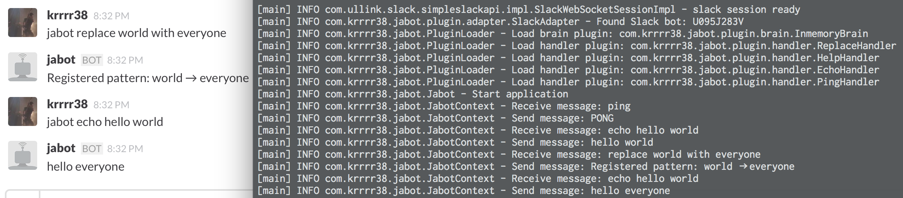

# Jabot

[](http://travis-ci.org/krrrr38/jabot)
[](https://maven-badges.herokuapp.com/maven-central/com.krrrr38/jabot)
[](LICENSE)

Java + Bot ⇒ Jabot

require Java8 or later

This module is inspired by [Ruboty](https://github.com/r7kamura/ruboty), thank you [r7kamura](https://github.com/r7kamura).



## Usage

Access [Releases Page](https://github.com/krrrr38/jabot/releases).

1. downlaod `jabot-app-*-executable.zip` and unzip (`mvn clean package`)
  - __NOTE__: Do not choose Source code zip. Please choose `jabot-app-**-executable.zip`.
2. edit `plugins.yml` to load adapter and handlers
3. add custom plugin into `lib` directory
4. `sh bin/jabot` (`-c /path/to/plugins.yml`)

One adapter is required. Handlers and Brain are optional. If brain is not set, in-memory brain would be used.

```
├── plugins.yml
├── bin
│   ├── jabot
│   └── jabot.bat
└── lib
    ├── jabot-echo-handler.jar
    ├── jabot-ping-handler.jar
    ├── jabot-inmemory-brain.jar
    ├── jabot-shell-adapter.jar
    ├── ...
    └── ... (more custom plugin jar)
```

plugins.yml example (namespace is used as brain namespace)

```yml
# this file is example plugins setting
name: jabot
adapter: # require one adapter
  plugin: com.krrrr38.jabot.plugin.adapter.ShellAdapter
  namespace: shell-adapter
  options:
    prompt: "> "
handlers: # NOTE: messages would be handled by THIS ORDER.
  - plugin: com.krrrr38.jabot.plugin.handler.HelpHandler
    namespace: help-handler
  - plugin: com.krrrr38.jabot.plugin.handler.PingHandler
    namespace: ping-handler
    options:
      foo: bar
brain:
  plugin: com.krrrr38.jabot.plugin.brain.InmemoryBrain
  namespace: inmemory-brain
  options:
    foo: bar
```

See [plugins directory](https://github.com/krrrr38/jabot/tree/master/plugins).

## Development jabot

```sh
git clone git@github.com:krrrr38/jabot.git
mvn clean test
```

## Development jabot Plugins
When using following plugins, just package and copy jar into plugins directory and edit `plugins.yml`, then restart jabot.

### Adapter
add dependency
```xml
<dependency>
  <groupId>com.krrrr38</groupId>
  <artifactId>jabot-adapter-plugin</artifactId>
</dependency>
```

write your Adapter which extends `Adapter`

### Handler
add dependency
```xml
<dependency>
  <groupId>com.krrrr38</groupId>
  <artifactId>jabot-handler-plugin</artifactId>
</dependency>
```

write your Handler which extends `Handler`

### Brain
add dependency
```xml
<dependency>
  <groupId>com.krrrr38</groupId>
  <artifactId>jabot-brain-plugin</artifactId>
</dependency>
```

write your Brain which extends `Brain`

## Distribution
packaging
```sh
$ mvn clean package # generate executable zip, tar.gz in `jabot-app/target`
```
